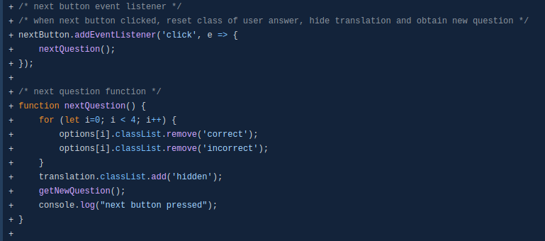

# German Idiom Quiz
# Overview of project
<!-- Am-i-responsive mock up -->

The German Idiom Quiz is an interactive quiz testing the user's knowledge of commonly used German phrases (or 'idioms').
The target audience for this quiz are language learners who speak English and are learning German.
The quiz asks the user to select the correct answer out of four possible options for the translation of a given German idiom.

The user has the option to see a literal English translation (which often does not provide many hints as to the meaning!) and to review the questions at the end of the quiz, providing an educational element to the quiz.


[View the live site](https://dragon-fire-fly.github.io/german-idiom-quiz)  

# User Experience (UX)

## User Stories
- As a user I would like to be able to quickly understand the purpose of the quiz and how to play.
- As a user I would like to have my knowledge of German idioms tested.
- As a user I would like to be able to review the asked questions so I can learn any phrases I did not already know.
- As a user I would like to have different, randomised questions each time I play the quiz.
- As a user I would like the navigation of the page to be clear and intuitive.
- As a user I would like to know whether I have selected the correct answer but also see the correct answer if I answered incorrectly.
- As a user, I would like to be able to see how long it took me to complete the quiz.
- As a user, I would like to be able to view and save my score.
- As a user, I would like to know if there is an English equivalent to some of the idioms.
- As a user, I would like to see a consistent use of colour and style.

[Back to Top](#german-idiom-quiz)

## Colour Scheme
The colour scheme for the quiz was heavily based around the colours of the German flag (red, yellow and back). An image of a distressed looking flag was used as the main background for all pages.
<!-- converted to webp -->


To complement the colours in the flag, accent colours were chosen and saved as `root` values, as shown below:

```
:root {
    /* Main colour scheme */
    --black: rgb(0,0,0);
    --white: rgb(255,255,255);
    --accent-red: rgb(221, 0, 0);
    --accent-gold: rgb(255, 206,0);
    --correct: rgb(140, 168, 145);
    --incorrect: rgb(231, 74, 57);
}
```
The bold, accent colours came from a ["Germany" palette](https://colorswall.com/palette/4646) and the softer green for correct answers were picked from a ["Germany minimalistic" palette](https://colorswall.com/palette/50961). The softer red colour for incorrect answers was a manually picked colour.

The colour scheme is shown below as a coolors colour palette:
  

[Back to Top](#german-idiom-quiz)

## Typography
A simple, clear typeface was chosen from Google Fonts. Only one font was used for this project to maintain consistency and readability but a variety of font weights were used to add visual interest.


[Back to Top](#german-idiom-quiz)

## Wireframes
<details>
<summary>The following wireframes were created at the start of the project in order to guide the design and functionality of the website.</summary>

### Welcome Page


### Main quiz page


### How to play modal


### High score board page
  

</details>

[Back to Top](#german-idiom-quiz)

# Features
## Existing Features
### Style Features
- Favicon  
A round german flag with a transparent background was used as a favicon for the site   


- High score page  
If there are not yet any highscores saved in local storage, the user will be invited to play the quiz. If there is at least one score in local storage, up to 5 scores will be displayed with the highest score at the top  


- Nav bar   
The nav bar allows the user to navigate back to the landing page (home) or open the "how to play" modal. The colours of these buttons were designed to complement the overall colour scheme, with an underline effect in the opposite colour appearing when hovered over


- How to play modal  
The how to play modal explains the basic rules and navigation for the quiz. The modal can be closed by clicking the "x" button or anywhere else on the page


- Buttons  
1. Start and highscore buttons
    - These allow the user to navigate from the landing page to the quiz or highscore pages
2. Start quiz button on highscore page
    - This allows the user to directly start the quiz from the highscore page
3. End of quiz option buttons
    - These buttons allow the user to save their score, play again (redirects to landing page or review the questions asked during the quiz)
4. Quiz navigation buttons - next, end and start again
    - Allow the user to progress to the next question, the end of the quiz or back to the landing page, respectively


- Question counter and progress bar  
The question counter and progress bar tell the user how many questions they have answered, how many questions are in the quiz and therefore what percentage through the quiz they are. The progress bar is coloured red with a black border to complement the overall colour scheme  


- Timer  
The timer counts up from 0 and is displayed in a HH:MM:SS format  


- Score  
The score starts at 0 with 1 point being added with each correctly answered question, to a maximum of 12 points  


- Question  
The question is simply displayed in the centre of the screen. Each time the quiz is run, 12 questions are randomly selected from a large question bank  


- Literal translation toggle  
The literal translation can be displayed by clicking the "+ Show/hide translation" toggle. Once opened, the "+" changed to a "-" to indicate the toggle is open. Once closed, it returns to its orignial "+" state 


- 4 possible answers  
The 4 randomised possible answers are displayed in yellow boxes. If the question is correctly answered, the box is highlighted in green and a check mark is shown. If the incorrect answer is chosed, the chosen answer is highliged in red with a cross mark and the correct answer is highlighted in green with a check mark so the user has the opportunity to see the correct answer  


- Review questions table  
At the end of the quiz, the user has the option to view a table summarising the 12 asked questions, their literal translation and correct meaning. If the question was answered correctly, it is highlighted in green. Otherwise, it is highlighted in red  


[Back to Top](#german-idiom-quiz)

### Javascript Functions
The implemented JavaScript functionality is sumarised below:

- pop-up box (modal) to see how to play the game
- option to return to the main page at any time
- option to view high score board
- question list with large bank of questions
- randomisation function which shuffles the question bank and selects 12 questions. This allows replayability of the quiz and ensures the same question is not asked more than once in the same play
- question number and progress bar displayed so user knows how many questions will be asked and which question they are currently answering
- The user is able to view the literal translation of the German phrase in English, if they wish. This allows the user to set their own difficulty level for a given question
- A count-up timer records how long the quiz attempt has taken
- Under each question are 4 possible answers for the user to choose between. They can simply click the answer to select it. If the correct answer is selected, the answer button turns green and a check mark appears. If the incorrect answer is selected, the chosen answer button turns red and a cross is shown (and the button for the correct answer turns green with a check mark to iundicate the correct answer)
- The score is updated by adding 1 for each correctly answered question, to a maximum of 12
- At the end of the quiz, the user has the option to submit their name to the high score board
- they also have the option to see a table of all questions asked in the quiz, their literal translations and their correct answers

[Back to Top](#german-idiom-quiz)

Detailed descriptions of each implemented JavaScript function can be read below:

`onLoad()`
- adds event listener for start button which when clicked hides start page and unhides quiz page, calls `startGame()` and starts timer
- adds event listener for Highscore button which when clicked hides start page, unhides highscore page and calls `getHighScores()`
- adds event listener for home button which reloads the page
- adds event listener for how to play button which opens the how to play modal
- adds event listener for the close button on the how to play modal
- adds event listener for a click outside the modal window
- both the close button and click outside event listeners close the how to play modal


#### `startGame()`
- sets starting values of question counter and score to 0
- retrieves the questions list from question.js
- calls the `shuffle()` function
- calls the `selectQuizQuestions()` function
- calls the `getNewQuestion()` function

#### `shuffle()`
- shuffles an array
- picks a random element from the array and swaps it with the current element
- This method is used to shuffle both the list of questions from the large question bank and the 4 possible answers for each question
- returns the full shuffled question list to the `startGame()` function and the answers to the `getNewQuestion()` function

#### `selectQuizQuestions()`
- takes the first 12 questions from the shuffled list
- returns these 12 Qs to the `startGame()` function

#### `startTimer()`
- retrieves the current UNIX time and saves as starting time
- sets the interval as 1000 milliseconds (1 second) so that the time is returned once per second

#### `countTimer()`
- retrieves the current UNIX time
- calculates the difference between the current UNIX time and the starting UNIX time, rounds down and divides by 1000 to give the timer in whole seconds
- formats the time to HH:MM:SS format
- adds event listener for end button to call the `stopTimer()` function, update the end timer and saves the end value to local storage

#### `stopTimer()`
- clears the time interval

#### `scoring()`
- increases the question counter each time a new quesiton is displayed
- updates the progress counter (question x of y)
- updates the progress bar
- if there is exactly one question remaining, hide the 'next' button and display the 'end' button instead.
- if there are no questions remaining on the quizQuestions list, add an end button event listener, which when clicked calls the `endGame()` function

#### `getNewQuestion()`
- calls `scoring()` function to update progress
- determines the current question and selects it from the list of 12 quiz questions
- updates the question text in the html file
- displays the literal translation (but awaits the user requesting it)
- displays the 4 possible answers in the html file and adds event listeners to each
- once an answer is selected, unhides the 'next' button and determines if it is correct or incorrect and applies the following changes:

if answer is correct:
- applies the 'correct' class to the selected answer for CSS styling (green colour)
- increases the quiz score by 1 point
- adds a check mark to the correct answer for accessibility
- changes the value of the "correct" key in the question object to "true" to indicate the user answered correctly

if answer is incorrect:
- applies the 'incorrect' class to the selected answer for CSS styling (red colour)
- also applies the 'correct' class to the correct answer for CSS styling (green colour)
- adds a cross to the chosen answer and a tick to the correct answer for accessibility

#### `hideNextButton()`
- hides the next button until the next time an answer is chosen

#### `toggleTranslation()`
- triggered if the user clicks the "see translation" button
- toggles the literal english translation of the question so it can be seen or hidden
- the '+' sign is changed to a '-' sign if clicked, then changed back to a '+' sign if clicked again, so the user can easily see if the translation is toggled on or off

#### `nextQuestion()`
- resets answers by removing 'correct' and/or 'incorrect' classes from answers
- hide literal translation
- calls the `getNewQuestion()` function

#### `increaseScore()`
- increases the global variable "score" by the POINT_VALUE value (in this case 1, but this is changable if desired)
- updates the text for the score in the html

#### `insertTable()`
- generates a summary table of the questions asked
- takes the list of 12 random questions as an argument
- inserts as many rows of html as there are in the random question list (12, but this is changable, if desired)
- adds one <td></td> each for the idiom, literal translation and correct meaning
- the row is coloured depending on whether the user got the answer correct (green) or incorrect (red)
- the rows are then injected into the html table

#### `endGame()`
- tidies up the screen at the end of the game
- hides the container that displays the questions
- unhides the summary page with score displayed
- displays a button with an event listener for users to click if they wish to review their answers
- calls the insertTable() function and passes in the questions from the quiz

#### `saveHighScore()`
- creates a dictionary from the locally stored items - `mostRecentScore`, `username` and `mostRecentTime`
- add newest score to the end of the `highScores` array
- sorts scores based on their values
- takes the first 5 scores from the array
- saves these scores as `highScores` into local storage

#### `getHighScores()`
- maps the highscores to the highscore list and adds a list item for each value in the array

[Back to Top](#german-idiom-quiz)


### Event Listeners
<!-- Nav bar -->
- `homeButton`
    - refreshes the page so the user can navigate to the starting page from anywhere on the site
- `howToPlayButton`
    - opens a modal which explains the features of the game to the user
- `closeModal`
    - allows the user to close the modal by clicking the "x"
- `window`
    - allows the user to close the modal by clicking anywhere outside the modal

<!-- Home page buttons -->
- `startButton`
    - allows the user to initiate the quiz
- `highScoreButton`
    - allows the user to view the current highscore list

<!-- Quiz buttons -->
- `translateButton`
    - allows the user to toggle the literal translation on and off
- `options`
    - display the 4 possible answers and allow the user to select one
- `nextButton`
    - allows the user to navigate to the next question
- `endButton`
    - stops the timer and saves the time to local storage
    - saves the score to local storage
    - ends the game

<!-- End of game buttons -->
- `reviewButton`
    - allows the user the option to review the questions asked during the quiz with their answers
- `playAgainBtn`
    - reloads the page, allowing the user to play again, if desired
- `username` field
    - allows the user to enter a nickname for the leaderboard, if desired
- `saveScoreBtn`
    - allows the user to save their score, if desired

### Other features:
- English equivalent feature
    - the user is shown an equivalent English idiom or phrase, where one is available


[Back to Top](#german-idiom-quiz)

## Features Left to Implement
- Reversed language (German to English) option. 
    - This would require a different question list to be made with the English equivalent (where present) to be set as the question and four possible answers to be created. Then, depending on which language is selected (by a button), one or the other list can be used for the game.
- Ability to play against other players
    - This could be achieved by saving the names, scores, etc to a database.
- Store the most recently asked Qs into local storage
    - This would enable the review table to be viewed later (until a new game is played). This would mean that the user can view the leaderboard or otherwise navigate around the site, and then revisit the summary table to see how they could improve next time.

[Back to Top](#german-idiom-quiz)

# Technologies used
- HTML5 for providing the core structure of the website pages
- CSS3 for styling the HTML documents
- JavaScript for providing the functionality and interactivity of the site
- [Gitpod](https://gitpod.io/) as a developer platform
- [Github](https://github.com/) as a code hosting platform
- [Git](https://git-scm.com/) for source code management
- [Balsamiq](https://balsamiq.com/) for creating wireframes at the start of the project to help guide HTML and CSS coding
- CSS grid for positioning elements and improved responsiveness within the style.css file
- `root` values in the style.css file for consistency and ease of alteration of colours and fonts
- [Convertio image converter](https://convertio.co/jpg-webp/) for converting the background image to a webp file format
- [Favicon.io](https://favicon.io/) for converting an image file into a 16x16 favicon

[Back to Top](#german-idiom-quiz)

# Testing
## Validator tests
- HTML Validation  
The site passed W3C HTML testing with no errors or warnings


- CSS validation  
The CSS code was pasted into the [W3C Validation Service](https://jigsaw.w3.org/css-validator/validator?uri=https%3A%2F%2Fdragon-fire-fly.github.io%2Fgerman-idiom-quiz%2F&profile=css3svg&usermedium=all&warning=1&vextwarning=&lang=en) and passed with no errors.

<p>
    <a href="https://jigsaw.w3.org/css-validator/check/referer">
        
    </a>
</p>
      
- JS Linter (JSHint)
Both JS files were passed through [JSHint](https://jshint.com/)
Both passed with no issues other than the undefined/unused variable of 'questions' due to them being seperate JS files  

- script.js

- questions.js


[Back to Top](#german-idiom-quiz)

## Responsiveness testing
The quiz was tested with [am-i-responsive](https://ui.dev/amiresponsive?url=https://dragon-fire-fly.github.io/german-idiom-quiz/) and performs on all tested screen sizes


Each page was compared at three standard screen sizes - mobile (375px), tablet (768px) and large laptop/desktop (1440px)

- Home page


- How to play modal


- Main quiz page


- Quiz end page


- Summary table


- Highscore page


[Back to Top](#german-idiom-quiz)

## Lighthouse testing
Lighthouse tests were performed using the built in lighthouse tool in Google Chrome Developer Tools. The aim of running Lighthouse tests is to improve site performance, accessibility and usability. The tests also measure the site crawlability and how highly it is displayed in search results in a search engine (SEO score). Scores over 90 are deemed to be very good.

The lighthouse test results for desktop and mobile are shown below:


[Back to Top](#german-idiom-quiz)

## Accessibility testing
An [Eightshapes contrast grid](https://contrast-grid.eightshapes.com/?version=1.1.0&background-colors=&foreground-colors=%23FFFFFF%2C%20White%0D%0A%23000000%2C%20Black%0D%0A%23dd0000%0D%0A%23ffce00%0D%0A%238ca891%0D%0A%23e74a39%0D%0A&es-color-form__tile-size=compact&es-color-form__show-contrast=aaa&es-color-form__show-contrast=aa&es-color-form__show-contrast=aa18&es-color-form__show-contrast=dnp) was created to check the contrast between the colours used on the page. The red text on black background received a score of 4 which makes it only suitable for large text. This combination was only used for the nav bar "home" button which is large text. All othe colour combinations used on the site produced a result of at least 5.1 (pass, AA rating), indicating they are suitable and readable.

 


The [WAVE web accessibility evaluation tool](https://wave.webaim.org/report#/https://dragon-fire-fly.github.io/german-idiom-quiz/) was used to test accessibility.

The tool identified a lack of contrast of main title with background image when it was white, so this was changed to black. It also identified a missing form label for the username input, which was consequently added and some skipped heading levels throughout the site, which were amended.

After fixing the suggested accessibility issues, the WAVE report was as follows, with 0 errors or alerts:


[Back to Top](#german-idiom-quiz)

## Browser compatibility
- Chrome  
All code was designed and tested throughout the development process on Chrome. All screenshots throughout the README were taken using the Chrome browser. All design features and functionality work as expected using Chrome (except those detailed in the [Remaining bugs](#outstanding) section)

- Firefox  
The firefox rendering of the page styling is quite different to in Chrome. The buttons have a grey border which contrasts strongly with the dark buttons, in contrast to the black/dark-grey borders presented in Chrome. Other than that, the quiz looks as expected.
- Start page in Firefox  

- Quiz page in Firefox  

- End page in Firefox  
  

In terms of functionality, most of the functions of the quiz work as expected, however the user cannot use the same name to save their high score to local storage as they have used before. This is in contrast to Chrome where the same name can be saved multiple times to local storage with different score and times.


[Back to Top](#german-idiom-quiz)

# Bugs
## Resolved

- Bug 1:  question counter and progress bar bug  
A bug was created during the early phases of development due to the `getNextQuestion()` function being too large and meaning that on each iteration of the function, the event listener for the next button was being triggered one additional time (once for the first question, twice for the second question, etc.) causing the question counter and progress bar to increment by more than one each time. This bug was solved by taking the event listener for the next button outside of the `getNextQuestion()` function and creating a new `nextQuestion()` function.

  
Originally the code was within the `getNextQuestion()` function...  

... but was moved outside to an event listener calling a new function `nextQuestion()`:


- Bug 2: `saveHighScore()` function being called twice  
Each time the user entered a name to save their score, the scoreboard was saving each entry twice. The source of this bug was found using a debugger to see that the `saveHighScore()` function was being called twice - once from the JS file and once from the HTML file. The HTML call was removed and the bug was solved


- Bug 3: When creating the `scoring()` function, the current score was erroneously being stored to the local storage when the question counter was on the last question, rather than when the end button was clicked (after the user has answered the final question). This was leading to the score being out by one if the user answered the final question correctly. To fix this bug, the `localStorage.setItem()` call was simply moved inside the event listener statement for the end button, as shown below.


- Bug 4: Whilst styling the page, the background image was assigned to `main` which created some overflow-x property issues on the main page which were overcome by setting the `overflow-x` property to hidden. This has the downstream effect of creating an internal scroll bar when the summary table was displayed, as shown in the screenshot below.
This bug was overcome by instead assigning the background properties to the `body` and removing the `overflow-x: hidden;` property which was no longer required. This fixed the internal scroll bar issue.


- Bug 5: When styling the table, CSS flex was used to improve positioning of the table element. `display: flex;` was added to the CSS for the table, however this caused the `hidden` class to be ignored and thus the table was always being shown, rather than only after the user clicks the 'review questions' button. This was fixed by moving the `display: flex;` property to its own `add-flex` class and only being added to the table if the user clicks the review button. 


- Bug 6: Page redirects after submitting high score
This was caused by the use of a form for submitting the high score. The form was removed and replaced simply with an input field. The corresponding classes and ids were updated from `form-submitted` and `form-saved` to `score-submitted` and `score-saved`.


[Back to Top](#german-idiom-quiz)

# Outstanding


[Back to Top](#german-idiom-quiz)

# Deployment
## Deployment with GitHub Pages
The site was deployed to GitHub Pages by taking the following steps:

Click on the "Settings" tab in the Github respository for the project
Find and click on the "Pages" subsection on the left-hand menu bar
Under "Source", select "Branch: main" and click save
After a few miunutes, the site should be successfully deployed and the link may be found on the same page or under "Environments" on the right hand side of the repository page.
From here, the "View Deployment" button leads directly to the deployed site.

  
  
  


## Forking someone else's repository
To create your own copy of this project on another computer, the following steps may be followed, which allow you to make a copy onto your own GitHub account, without changing the original code that you are copying:

Locate the repository of the project you would like to copy
In the top-right corner of the repository click on the "fork" button
Navigate to your fork of the project and start coding!

  

## Creating a local clone of a project
Following these steps will allow you to clone a repository and open it in your local IDE, for example Visual Studio Code, Eclipse or NetBeans:

Locate the repository of the project you would like to copy
Click the green "Code" button to access a drop down menu
Ensuring that HTTPS is selected, select the copy button (as shown in the screenshot below) to copy the URL of the repository of interest
Open your local IDE and change the current working directory in GitBash to the desired location for the new repository
In the command line, type 'git clone' and paste the URL obtained earlier from GitHub.

  

Alternatively, you can create a local copy of this repository, by typing the follow into your IDE terminal:
- `git clone https://github.com/dragon-fire-fly/german-idiom-quiz.git`

Or, if using Gitpod, you can click below to create your own workspace using this repository.

[](https://gitpod.io/#https://github.com/dragon-fire-fly/german-idiom-quiz)

[Back to Top](#german-idiom-quiz)

# Credits
## Content

A number of reference sources and tutorials were utilised for this project. The main quiz structure, progress bar and score tracking were based on the YouTube tutorial by [Brian Design](https://www.youtube.com/watch?v=f4fB9Xg2JEY) with reference to this [Web Dev Simplified](https://www.youtube.com/watch?v=riDzcEQbX6k) quiz tutorial.

This [Stack Overflow](https://stackoverflow.com/questions/2450954/how-to-randomize-shuffle-a-javascript-array) answer was helpful for learning how to shuffle a list of objects using JavaScript.

This [Stack Overflow](https://stackoverflow.com/questions/5517597/plain-count-up-timer-in-javascript) answer was helpful for implementing a count up timer.

This YouTube video by [Dylan Israel](https://www.youtube.com/watch?v=ri5Nqe_IK50) helped to implement a table whose values are updated using JavaScript.

Some of the German Idioms used in the quiz were found in these [FluentU](https://www.fluentu.com/blog/german/common-german-idioms/) and [Chatterbug](https://blog.chatterbug.com/en/10-german-idioms-to-sound-more-german/) blog posts.

[Back to Top](#german-idiom-quiz)

## Media
[Strong Germany palette](https://colorswall.com/palette/4646)  
[Soft Germany palette](https://colorswall.com/palette/50961)  
[Distressed German flag](https://img.wallpapersafari.com/desktop/1920/1080/61/86/eQLs4h.jpg)
[German flag favicon image](https://www.kindpng.com/imgv/hombwi_round-germany-flag-png-transparent-image-circle-german/)

[Back to Top](#german-idiom-quiz)

## Acknowledgements
I would like to thank my Mentor Tim Nelson for all his advice, encouragement and enthusiasm during the development of this quiz. Thank you for helping me to fix many bugs and giving useful ideas and helpful hints!

I would also like to thank my husband who contributed many of the idioms for the quiz and the Code Institute community on Slack, particularly Dave Horrocks who helped with my question counter bug and the class of May 2022 who provide support and enthusiasm for the course.

[Back to Top](#german-idiom-quiz)